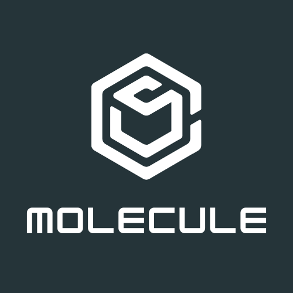

<!-- Improved compatibility of back to top link: See: https://github.com/othneildrew/Best-README-Template/pull/73 -->

<!--
*** Thanks for checking out the Best-README-Template. If you have a suggestion
*** that would make this better, please fork the repo and create a pull request
*** or simply open an issue with the tag "enhancement".
*** Don't forget to give the project a star!
*** Thanks again! Now go create something AMAZING! :D
-->

<!-- PROJECT SHIELDS -->
<!--
*** I'm using markdown "reference style" links for readability.
*** Reference links are enclosed in brackets [ ] instead of parentheses ( ).
*** See the bottom of this document for the declaration of the reference variables
*** for contributors-url, forks-url, etc. This is an optional, concise syntax you may use.
*** https://www.markdownguide.org/basic-syntax/#reference-style-links
-->

[![Contributors][contributors-shield]][contributors-url]
[![Forks][forks-shield]][forks-url]
[![Stargazers][stars-shield]][stars-url]
[![Issues][issues-shield]][issues-url]
[![MIT License][license-shield]][license-url]

<!-- PROJECT LOGO -->
 

  

<h3 align="center">Molecule</h3>

  

    A command line application to make discord.js easier!
     
    <a href="https://github.com/raining-codes/molecule"><strong>Explore the docs »</strong></a>
     
     
    <a href="https://github.com/raining-codes/molecule">View Demo</a>
    ·
    <a href="https://github.com/raining-codes/molecule/issues">Report Bug</a>
    ·
    <a href="https://github.com/raining-codes/molecule/issues">Request Feature</a>
  

<!-- ABOUT THE PROJECT -->

## About The Project

[![Product Name Screen Shot][product-screenshot]](https://example.com)

Molecule is a simple Command Line Application written in C#. It helps you generate discord.js bots. Again, this is a discord bot **generator**, not a bot itself. Its configuration is saved in molecule.json. Its currently only available on Windows.

Molecule offers you:

* Creating a project in discord.js
* A command handler
* A event handler
* Easly generate events with its documentation links
* Easly generate commands
* Conection to a database
* Simplicity

**Full Changelog**: https://github.com/raining-codes/molecule/commits/Release

(<a href="#readme-top">back to top</a>)

<!-- GETTING STARTED -->

## Getting Started

Installing molecule is pretty easy and straightforward.

### Installation

1. Download latest setup file from [https://github.com/raining-codes/molecule/releases/](Releases)
2. Run the installation file and **don't** change the default path.
3. After the installation is complete, search for environment variables and click on the first result.
4. Click environment variables.
5. Select Path and click edit
6. Now click new and type molecules installation location.
7. Click apply and ok.

(<a href="#readme-top">back to top</a>)

<!-- USAGE EXAMPLES -->

## Usage

### Making a new bot
To make a new discord bot using molecule, open terminal in your preffered location and type `molecule new`. This will ask you a couple of questions, These questions are:
1. Bot name
2. Your preffered language
3. Your package manager
4. Your bots token
5. Your MongoDB Database URI (If you don't have a database just skip this)
6. Rather or not to use slash commands

After you've answered these questions, Molecule will create a new folder and create a simple ping slash command.

### Generating events or commands
To add your own custom commands and events, you need to follow these instructions.
1. Open terminal in a molecule project directory.
2. Run `molecule gen`, this will ask you to generate a event or command.
3. Select your option and press enter.

If you selected event, theres gonna be list of all events and you can create multiple events at once. Your generated event files are gonna be located in src/events.

If you selected command, it will ask for command name and description. Command file will be located in src/commands

_For more examples, please refer to the [Documentation](https://example.com)_

(<a href="#readme-top">back to top</a>)

<!-- LICENSE -->

## License

Distributed under the MIT License.

(<a href="#readme-top">back to top</a>)

<!-- CONTACT -->

## Contact

Your Name - **George Tskitishvili**

Project Link: [https://github.com/raining-codes/molecule](https://github.com/raining-codes/molecule)

(<a href="#readme-top">back to top</a>)

<!-- MARKDOWN LINKS & IMAGES -->
<!-- https://www.markdownguide.org/basic-syntax/#reference-style-links -->

[contributors-shield]: https://img.shields.io/github/contributors/raining-codes/molecule.svg?style=for-the-badge
[contributors-url]: https://github.com/raining-codes/molecule/graphs/contributors
[forks-shield]: https://img.shields.io/github/forks/raining-codes/molecule.svg?style=for-the-badge
[forks-url]: https://github.com/raining-codes/molecule/network/members
[stars-shield]: https://img.shields.io/github/stars/raining-codes/molecule.svg?style=for-the-badge
[stars-url]: https://github.com/raining-codes/molecule/stargazers
[issues-shield]: https://img.shields.io/github/issues/raining-codes/molecule.svg?style=for-the-badge
[issues-url]: https://github.com/raining-codes/molecule/issues
[license-shield]: https://img.shields.io/github/license/raining-codes/molecule.svg?style=for-the-badge
[license-url]: https://github.com/raining-codes/molecule/blob/master/LICENSE.txt
[linkedin-shield]: https://img.shields.io/badge/-LinkedIn-black.svg?style=for-the-badge&logo=linkedin&colorB=555
[linkedin-url]: https://linkedin.com/in/linkedin_username
[product-screenshot]: images/screenshot.png
[next.js]: https://img.shields.io/badge/next.js-000000?style=for-the-badge&logo=nextdotjs&logoColor=white/
[next-url]: https://microsoft.com/
[react.js]: https://starship.rs/icon.png
[react-url]: https://github.com/shibayan/Sharprompt
[vue.js]: https://img.shields.io/badge/Vue.js-35495E?style=for-the-badge&logo=vuedotjs&logoColor=4FC08D
[vue-url]: https://vuejs.org/
[angular.io]: https://img.shields.io/badge/Angular-DD0031?style=for-the-badge&logo=angular&logoColor=white
[angular-url]: https://angular.io/
[svelte.dev]: https://img.shields.io/badge/Svelte-4A4A55?style=for-the-badge&logo=svelte&logoColor=FF3E00
[svelte-url]: https://svelte.dev/
[laravel.com]: https://img.shields.io/badge/Laravel-FF2D20?style=for-the-badge&logo=laravel&logoColor=white
[laravel-url]: https://laravel.com
[bootstrap.com]: https://img.shields.io/badge/Bootstrap-563D7C?style=for-the-badge&logo=bootstrap&logoColor=white
[bootstrap-url]: https://getbootstrap.com
[jquery.com]: https://img.shields.io/badge/jQuery-0769AD?style=for-the-badge&logo=jquery&logoColor=white
[jquery-url]: https://jquery.com
